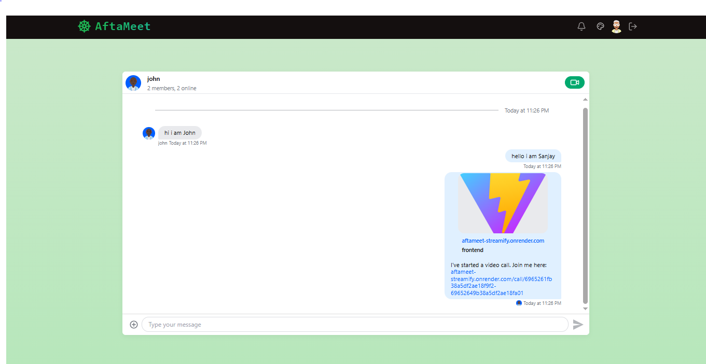
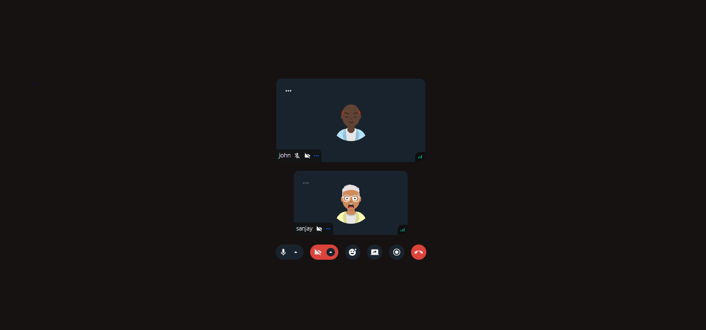
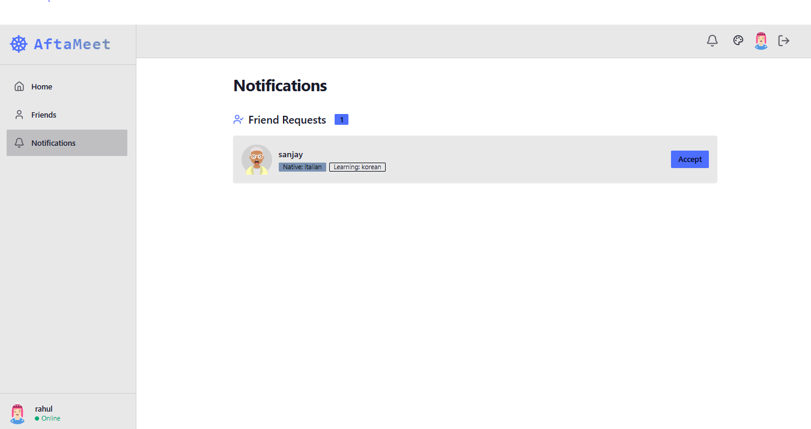
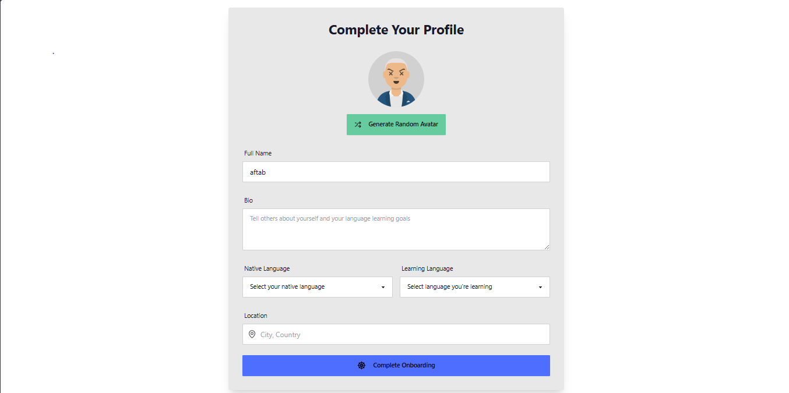
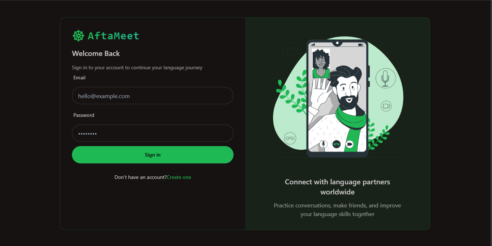
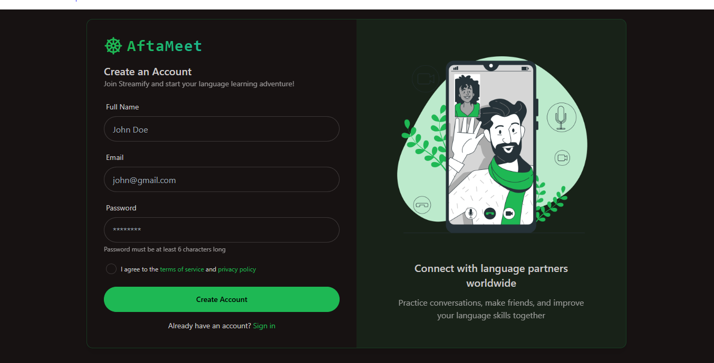
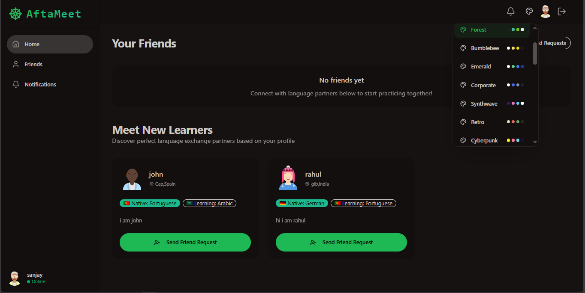
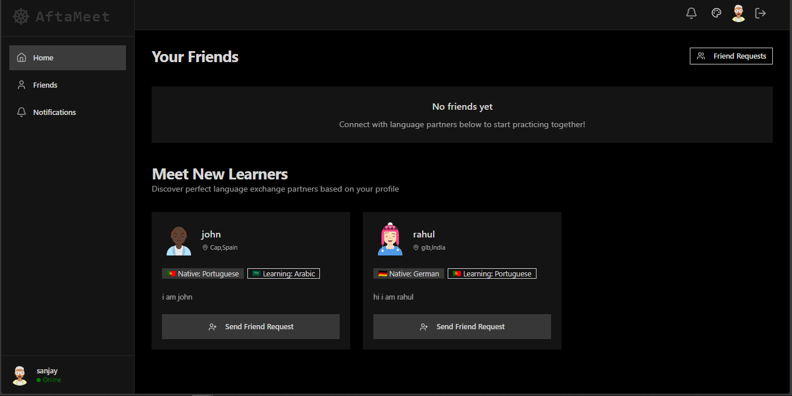
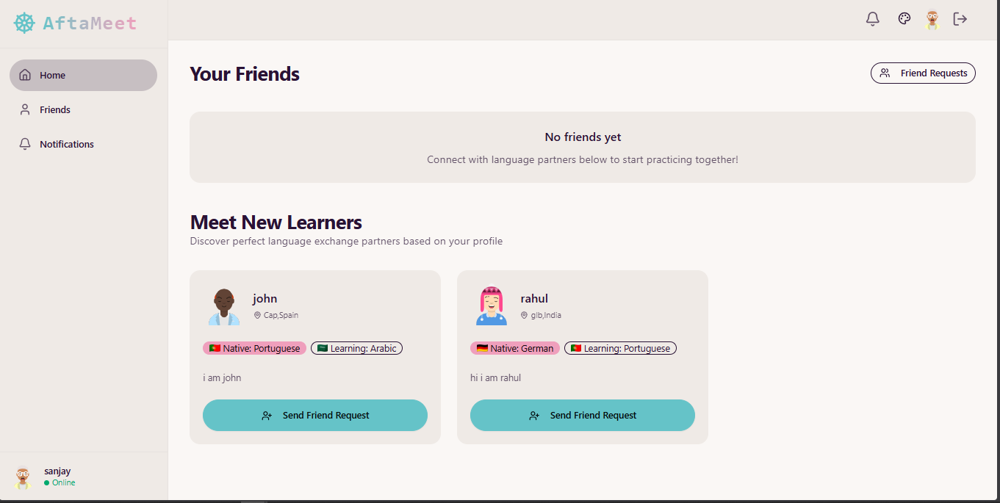
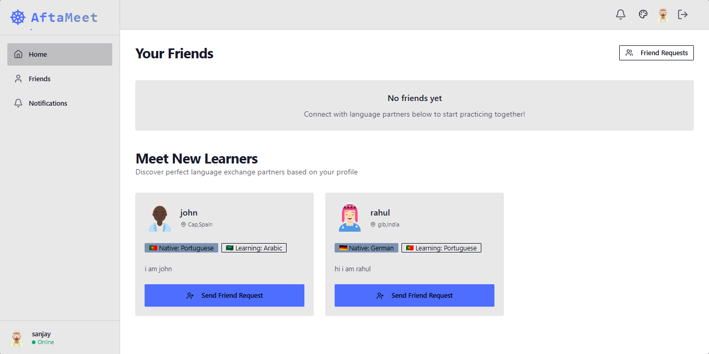

# AftaMeet - Modern Video Conferencing Solution

AftaMeet is a feature-rich video conferencing application built with modern web technologies, providing seamless real-time communication experiences.

## 🌐 Live Demo

[](https://aftameet-streamify.onrender.com)


## 🚀 Features

- 🎥 High-quality video and audio calls
- 🎨 Multiple theme support with DaisyUI (dark, light, corporate, forest, and more)
- 🔒 Secure end-to-end encrypted communications
- 💬 Real-time chat and messaging
- 📅 Schedule and join meetings
- 🎤 Screen sharing capabilities
- 🔄 Cross-platform compatibility
- 🌓 Automatic dark/light mode based on system preferences

## ✨ Key Features with Visuals

### 💬 Chat

Seamless real-time messaging with read receipts and typing indicators.

### 📹 Video Calls

High-quality video conferencing with multiple participants and screen sharing.

### 🔔 Notifications

Stay updated with real-time notifications for messages, calls, and meeting reminders.

### 🚀 Onboarding

Quick and easy setup process to get you started in minutes.

## 🛠️ Tech Stack

### Frontend
- React 19
- Vite
- TypeScript
- React Router DOM
- TailwindCSS with DaisyUI
- React Query
- Stream Video SDK
- Theme customization

### Backend
- Node.js
- Express
- WebSockets
- JWT Authentication

## 📦 Prerequisites

- Node.js (v18 or higher)
- npm (v9 or higher) or yarn
- Stream API credentials

## 🚀 Getting Started

### 1. Clone the Repository
```bash
git clone https://github.com/syedaftab-dev/streamify.git
cd AftaMeet
```

### 2. Install Dependencies
```bash
# Install root dependencies
npm install

# Install frontend dependencies
cd frontend
npm install

# Install backend dependencies
cd ../backend
npm install
```

### 3. Environment Setup
Create a `.env` file in the root directory with the following variables:

```env
# Frontend
VITE_API_URL=http://localhost:3000
VITE_STREAM_API_KEY=your_stream_api_key

# Backend
PORT=3000
MONGODB_URI=your_mongodb_uri
JWT_SECRET=your_jwt_secret
```

### 4. Run the Application

#### Development Mode
```bash
# Start backend server
cd backend
npm run dev

# In a new terminal, start frontend
cd ../frontend
npm run dev
```

#### Production Build
```bash
# Build frontend
cd frontend
npm run build

# Start production server
cd ../backend
npm start
```

## 📸 Screenshots

### 🏠 Authentication & Dashboard
|  |  |
|--------------------------------------|----------------------------------------|
| **Login Page**                       | **Signup Page**                        |

|  |
|-----------------------------------------|
| **Dashboard**                          |

### 🎨 Theme Variants
|  |  |
|--------------------------------------------|---------------------------------------------|
| **Dark Theme**                            | **Light Theme**                             |

|  |  |
|-----------------------------------------------------|-----------------------------------------------|
| **Corporate Theme**                                | **Forest Theme**                              |

### ✨ Key Features
|  |  |
|-----------------------------------------|-------------------------------------------|
| **Real-time Chat**                      | **Video Conferencing**                    |

|  |  |
|------------------------------------------------|-------------------------------------------|
| **Smart Notifications**                       | **Easy Onboarding**                       |


## 🤝 Contributing

Contributions are welcome! Please feel free to submit a Pull Request.

## 📧 Contact

For any inquiries, please reach out to [syed.md.aftab.2027@gmail.com](mailto:syed.md.aftab.2027@gmail.com)

---

Made with ❤️ by [Syed Aftab](https://github.com/syedaftab-dev)
